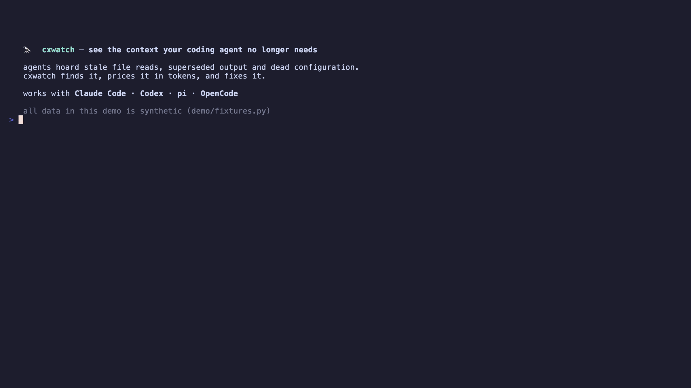

# cxwatch 🔭

**Find stale session context and unused agent configuration before they waste tokens.**

`cxwatch` is the command-line tool in the `dalekohled` project. It audits the context of AI coding agents such as Claude Code, Codex, pi, and OpenCode.



Coding agents collect context while they work. An old file read can remain after an edit. A large tool result can stay in the session after it is no longer useful. Skills, MCP servers, commands, hooks, and memory files can also remain configured after you stop using them.

`cxwatch` finds this waste and shows:

- what is stale, large, duplicated, or unused;
- how many tokens each finding costs;
- the evidence for each finding;
- the file or command that can fix it.

The default checks are deterministic and local. `cxwatch` only reports findings. It does not change your files or configuration.

## Quick start

```bash
cxwatch
```

The interactive view lists recent sessions from all supported agents. Select a session to see the largest context problems first. Press `Ctrl+E` to open the static context audit.

You can also run direct commands:

```bash
cxwatch report                    # Audit the most recent session
cxwatch report path/to/run.jsonl  # Audit one session file
cxwatch estate                    # Audit static agent configuration
cxwatch estate -o cleanup.md      # Write a cleanup report
cxwatch estate --json             # Return machine-readable output
cxwatch estate --fix              # Apply mechanical fixes interactively
cxwatch status                    # One-line rot-o-meter for the latest session
```

## Install

You need Rust 1.88 or later.

```bash
git clone https://github.com/aalises/dalekohled.git
cd dalekohled
cargo install --path .
```

You can also install from GitHub:

```bash
cargo install --git https://github.com/aalises/dalekohled
```

OpenCode support needs the `sqlite3` command. macOS includes this command by default.

## What cxwatch audits

### Session context

The session audit checks the transcript of one agent run.

| Check | What it finds |
|---|---|
| `stale-read` | A file read that appears before a later edit of the same file |
| `superseded-read` | A file read that appears before a later read of the same file |
| `huge-thinking` | A reasoning block with more than 2,000 tokens |
| `huge-output` | A tool result with more than 2,500 tokens |

For stale and superseded reads, `cxwatch` assigns the token cost of the related tool result. This shows the context that the session can reclaim.

### Static context

The estate audit compares configured context with observed use in local transcripts.

| Check | What it finds |
|---|---|
| `dead-mcp` | An MCP server with no observed calls in its agent |
| `dead-skill` | A skill with no observed use after a 14-day grace period |
| `dead-command` | A Claude Code command with no observed use |
| `duplicate-directive` | Repeated skill guidance in `CLAUDE.md` |
| `hook-tax` | Large payloads from Claude Code hooks |
| `orphan-memory` | A memory file that is absent from `MEMORY.md` |
| `dangling-index` | A `MEMORY.md` entry for a missing file |
| `stale-ref` | An instruction or memory file that refers to a missing path |
| `stale-memory` | A memory file that has not changed for 120 days |
| `heavy-block` | An instruction section with more than 400 tokens |

The cleanup report groups findings by action. Each item includes a path, evidence, and a proposed fix. Review all deletion and configuration changes before you apply them.

## Apply fixes

Some findings have a mechanical fix: repair a memory index, delete an unused command or skill, remove an unused MCP server. `cxwatch` can apply these for you:

```bash
cxwatch estate --fix        # Confirm each fix: y, n, a (all), or q (quit)
cxwatch estate --fix --yes  # Apply all mechanical fixes without prompts
```

In the interactive estate view, press `F` once to see the fix and press `F` again to apply it.

Before any change, `cxwatch` copies the affected file to `~/.cache/cxwatch/trash`. Deleted files and directories move there instead of being removed. Findings without a mechanical fix stay report-only; use the cleanup report for those.

## Rot-o-meter

`cxwatch status` prints a one-line summary of the most recent session across all agents:

```
[codex] rot  62% ██████░░░░ ~135.8k tok reclaimable · 47 findings
```

Results are cached by session size, so repeated calls return in milliseconds. Use it anywhere that shows a line of text:

- **Claude Code statusline** — add to `~/.claude/settings.json`:

  ```json
  { "statusLine": { "type": "command", "command": "cxwatch statusline" } }
  ```

  `cxwatch statusline` reads the statusline JSON on stdin and reports the rot of the *current* session. If you already have a statusline script, append `cxwatch statusline` output to it.

- **tmux** — works for every agent running in the terminal:

  ```
  set -g status-right '#(cxwatch status)'
  set -g status-interval 15
  ```

- **Codex** — point `notify` in `~/.codex/config.toml` at a script that runs `cxwatch status` and raises a notification above your threshold.

## Supported agents

| Agent | Session source | Static context source |
|---|---|---|
| Claude Code | `~/.claude/projects` | Skills, commands, memory, hooks, MCP servers, and `CLAUDE.md` |
| Codex | `~/.codex/sessions` and `~/.codex/archived_sessions` | Plugin skills, MCP servers, and `AGENTS.md` |
| pi | `~/.pi/agent/sessions` | Package skills |
| OpenCode | `~/.local/share/opencode/opencode.db` | `~/.config/opencode/AGENTS.md` |

## Semantic analysis

The optional semantic pass looks for contradictions and repeated guidance that deterministic checks cannot find.

```bash
cxwatch report --semantic
cxwatch estate --semantic -o cleanup.md
cxwatch pick --semantic
```

This pass needs the `pi` command. It uses the `moonshotai/kimi-k3` model by default. Set `CXWATCH_SEMANTIC_MODEL` to use a different model.

Important: the semantic pass sends a limited digest to the model through `pi`. The digest can contain session messages, instructions, skills, and memory text. Do not use `--semantic` until you have checked the data policy and configuration of your model provider. The default audit does not send this content to a model.

## Interactive controls

Session picker:

- Type to filter the list.
- Use `Up` and `Down` to move.
- Press `Enter` to audit a session.
- Press `Ctrl+E` to open the estate audit.
- Press `Tab` to enable or disable semantic analysis.
- Press `Esc` to clear the filter or exit.

Report and estate views:

- Use `Up` and `Down` to scroll.
- Press `Enter` to show the proposed fix for an estate finding.
- Press `F` twice to apply a mechanical fix (first press shows what will change).
- Press `E` to export a Markdown report.
- Press `Esc` to return to the picker.
- Press `Q` to exit.

## Output for scripts

Use JSON output when another tool must process the findings:

```bash
cxwatch report --json
cxwatch estate --json
```

The JSON output includes the report version, summary, findings, token counts, and fix data. Markdown output is suitable for review or for a separate cleanup task.

## Token counts and limits

Session reports and file-based estate checks use the `o200k` tokenizer. Hook findings show the average token cost of one observed firing.

Detection depends on the transcript formats that each agent writes. Shell command analysis covers common file readers such as `cat`, `head`, `tail`, and `sed`. A report can miss operations that use a different event or command format.

## Development

Run the test suite:

```bash
cargo test
```

The terminal recording uses [VHS](https://github.com/charmbracelet/vhs):

```bash
brew install vhs
vhs demo.tape
ffmpeg -y -i demo.mp4 -vf "fps=15,scale=1200:-1:flags=lanczos,split[s0][s1];[s0]palettegen=max_colors=128:stats_mode=diff[p];[s1][p]paletteuse=dither=bayer:bayer_scale=3:diff_mode=rectangle" demo.gif
```

`vhs` records the source video. `ffmpeg` creates a smaller GIF for the README.

The recording can contain real session names and findings from your computer. Review `demo.gif` and `demo.mp4` before you publish them.

## License

This project uses the MIT License. See [LICENSE](LICENSE).
